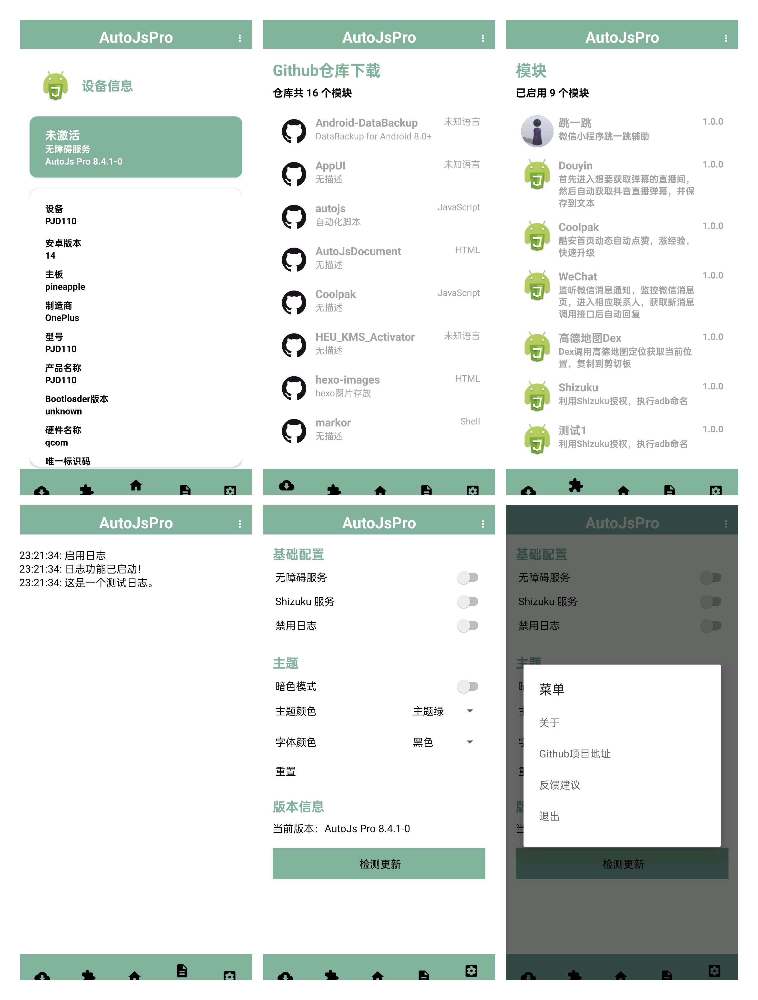
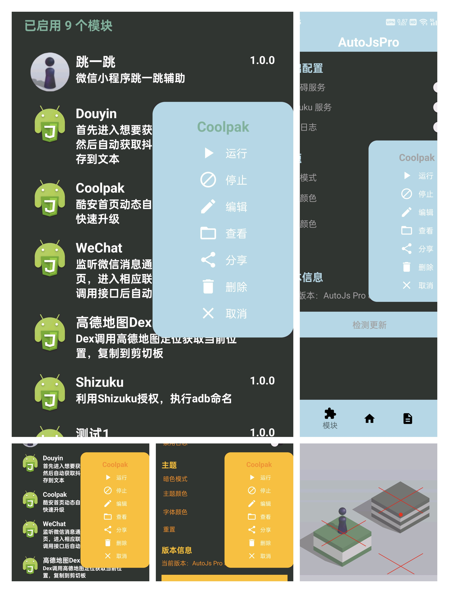

<<<<<<< HEAD
# autojs自动化脚本
###### 需要搭配autojs使用，开启无障碍权限
###### 前面发的只支持微信8.0.40版
#### main.js适配的是微信8.0.42
- 微信定时给指定的联系人发消息。
- 微信自动回复Wechat
- 酷安自动点赞Coolpak
- 详见其他仓库已打包。
=======
# AppUI 介绍

## 简介
`AppUI` 是基于AutoJsPro8 创建的应用，仿`Lsposed` 的 UI 界面。
 `AppUI`是应用的UI模型，当然也可以实现应用模块化管理。
- 便捷启用无障碍
- 连接Shizuku 服务，通过Shizuku授权，执行adb相关的命令
- 应用主题自定义，暗色模式，字体颜色，主题颜色等
- 应用脚本模块化管理
- Github仓库脚本下载功能，待完善

## 应用预览





## 注意
- 需要连接网络，请求Github网络仓库，动态绑定设置模块资源，可能闪退
- 检测更新，需要连接访问Github，通过Github的api检测更新，可能闪退
- 在模块管理中，直接修改应用需要root，当然你也可以直接下载仓库源码，实现免root修改，后重新打包，或者直接放在脚本路径下，AutoJsPro可以直接运行
- 自定义 模块 置于主脚本 `main.js` 的同级目录 `modules`下，该目录下的文件名即为 模块名
模块中，图标icon.png，配置config.json，例如
```json
{
    "name": "酷安点赞",
    "icon": "icon.png",
    "description": "酷安首页动态自动点赞，涨经验，快速升级",
    "version": "1.0.0"
}

```

- runJs目录是工具脚本，目前只有一个`检测更新`的脚本


##


>>>>>>> appui/main
